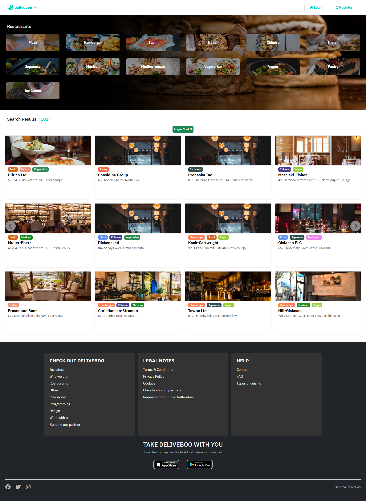
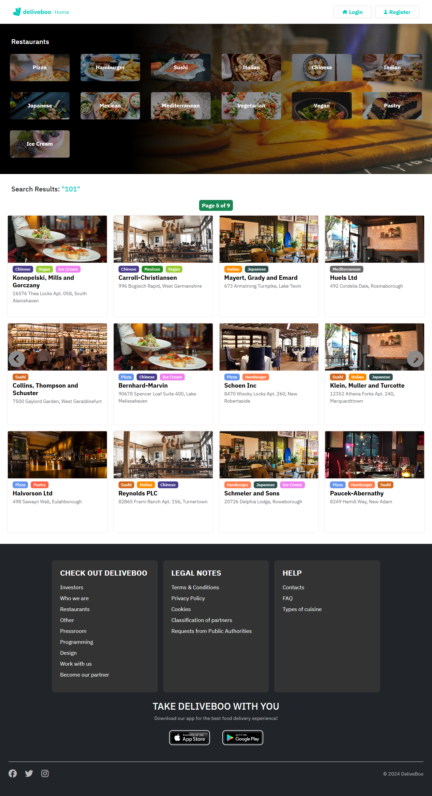
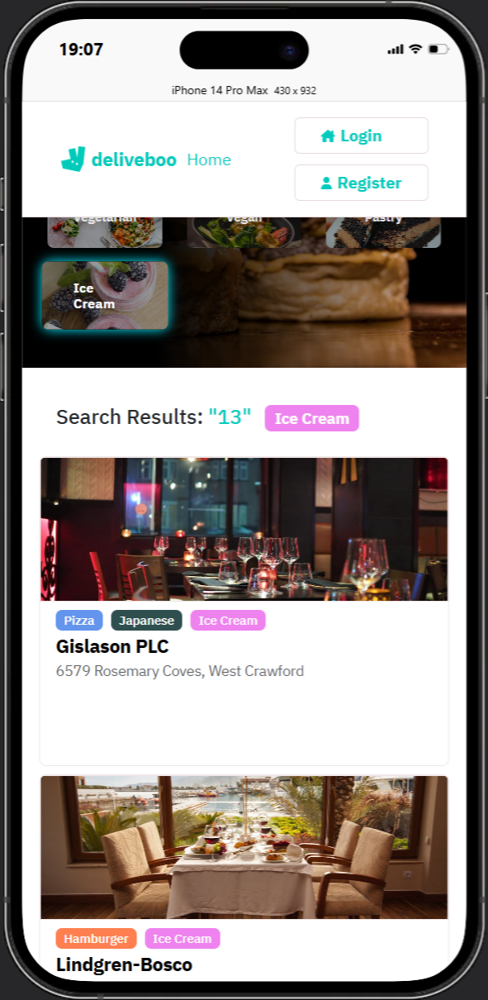

# Galleria immagini

- ### 💻 Home (Laptop view) 

{ width="45%" height="500px" margin="0 auto"} { width="45%" height="500px" margin="0 auto"}

- ### 💻 Home (Search by Tipology)

{ width="50%" }

- ### 💻 Home (Mobile view)

  - ### 📱 iPhone 14 Pro

{ height="500px" }

  - ### 📱 iPhone 14 Pro Max

{ height="500px" }

- ### 💻 Single Restaurant (Laptop view)

{ width="50%" }

- ### 💻 Single Restaurant (Mobile view)

{ height="500px" }

- ### 💻 Checkout (Laptop view)

{ width="50%" }

- ### 💻 Order Review (Laptop view)

{ width="50%" }

