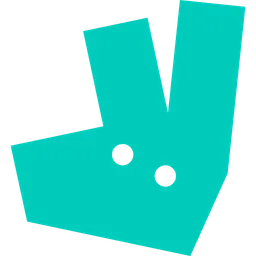

<div style="text-align: center;">

{ height="100px" } 

</div>

# DeliveBoo - Food Delivery Platform

{ height="50px" }

DeliveBoo è una piattaforma di food delivery ispirata dalle piattaforme mderne più famose e celebri del Web, sviluppata con Vue 3, integrata con un backend Laravel 10 e MySQL.

Vai alla repository backend [DeliveBoo-BE](https://github.com/orazi-paolo/deliveboo-laravel10).

> **Nota**: _Per non riscontrare problemi consigliamo di avviare il server backend prima di avviare il frontend, esegui `npm run dev` e poi `php artisan serve` per avviare il server Laravel nel progetto BE._

## 📸 Galleria

- [Galleria immagini](GALLERY.md)

## 🚀 Caratteristiche Principali

- **Ricerca Ristoranti**: Filtraggio dei ristoranti per tipologia di cucina
- **Gestione Carrello**: Aggiunta/rimozione prodotti e gestione quantità, calcolo totale ordine e persistenza del carrello
- **Sistema di Pagamento**: Integrazione con Braintree per pagamenti sicuri
- **Interfaccia Responsive**: Design adattivo per desktop e mobile
- **Animazioni Fluide**: Transizioni ed effetti visivi per una migliore UX

## 🛠️ Tecnologie Utilizzate

- **Frontend**:
  - JavaScript
  - Vue 3
  - Vite
  - SCSS
  - Bootstrap 5
  - Axios
  - Vue Router
  - Font Awesome
  - AOS (Animate On Scroll)
  - Braintree Drop-in UI

## 🔧 Installazione

1. Clona il __repository__

```bash
git clone https://github.com/orazi-paolo/deliveboo-vue3.git
```

2. Installa le dipendenze

```bash
npm install
```

3. Avvia il server di sviluppo

```bash
npm run dev
```

4. Apri il browser con l'indirizzo che fornisce `npm run dev`


5. Per la build di produzione

```bash
npm run build
```

## 📦 Struttura del Progetto

```bash
src/
├── assets/ # Immagini e risorse
├── components/ # Componenti Vue riutilizzabili
├── js/ # File JavaScript principali
│ ├── router.js # Configurazione Vue Router
│ └── store.js # Gestione stato applicazione
├── pages/ # Componenti pagina
└── style/ # File SCSS globali
```

## 🤝 Contributi

Contribuisci al progetto! Consulta la [guida per i contributi](CONTRIBUTING.md) per informazioni su come contribuire.

## 🔐 Funzionalità Principali

#### 🍽️ Gestione Ristoranti
- Visualizzazione lista ristoranti
- Filtro per tipologia di cucina
- Dettaglio singolo ristorante
- Dettaglio singolo prodotto

#### 🛒 Gestione Ordini
- Carrello dinamico e persistente
- Modifica quantità prodotti
- Calcolo totale ordine
- Checkout con form di pagamento

#### 💳 Sistema di Pagamento
- Integrazione Braintree
- Form di pagamento sicuro
- Validazione dati cliente
- Conferma ordine

## 👥 Team di Sviluppo

👨‍💻 [@orazi-paolo](https://github.com/orazi-paolo)
👩‍💻[@natdm02](https://github.com/natdm02)
👨‍💻[@orsoli](https://github.com/orsoli)
👨‍💻[@JeromeMaligaya](https://github.com/JeromeMaligaya)
👨‍💻[@Marcap00](https://github.com/Marcap00)

## 📄 Licenza

Questo progetto è rilasciato sotto la licenza [MIT License](LICENSE).

Copyright © 2024 [DeliveBoo](https://github.com/orazi-paolo/deliveboo-vue3).

Concessione gratuita per utilizzare, copiare, modificare, fondere, pubblicare, distribuire, sublicenziare e/o vendere copie del Software, e per permettere a chiunque altro a farlo, a condizione che il copyright originale e questa dichiarazione di licenza siano inclusi in tutte le copie o parti sostanziali del Software.

IL SOFTWARE È FORNITO "COSÌ COM'È", SENZA GARANZIA DI ALCUN TIPO, ESPRESSA O IMPLICITA, INCLUSE MA NON LIMITATE A GARANZIE DI COMMERCIABILITÀ, IDONEITÀ PER UNO SCOPO PARTICOLARE E NON INFRAZIONE. IN NESSUN CASO IL DETENTORE DEL COPYRIGHT O I CONCESSIONARI SONO RESPONSABILI PER QUALSIASI DANNO O PERDITA, SIA IN UN'AZIONE CONTRATTUALE, ILLECITA O ALTRIMENTI, DERIVANTE DA, O IN CONNESSIONE CON, L'UTILIZZO DEL SOFTWARE.
